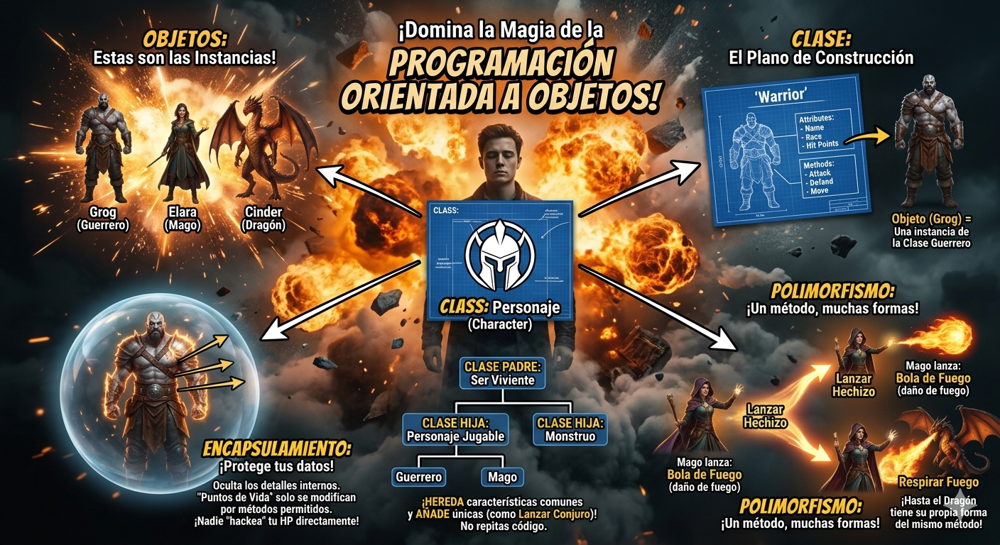

# Python_POO

Introducción a la programació orientada a objetos en Python

## Por que aprender POO?

 - Imagina que quieres crear un **video jogo** tienes guerreros, magos, dragones... Cada Uno con sus propios puntos de vida, ataques y habilidades, como los organizo en código? sin repetir todo una y otra vez?

 - La **Programación Orientada a Objetos (POO)** es la respuesta! En lugar de escribir instrucciones sueltas, modelas el mundo real con ***objetos*** que tienen características y comportamientos, es la forma en que están construidos la mayoría de los programas profecionales del mundo



## Clase y Objeto

 - Una clase es un tipo de dato cuyas variables se llaman "**Objetos**" ó "**Instancias**"

 - La clase es la definición del concepto del mundo real y los objetosó Instancias son el propio objeto del mundo real
 
 - Las clases están compuestas por 2 elementos:
    - **Atributos:** Informarción que almacena la clase
    - **Metodos:** Operaciones que pueden realizarse con la clase

## Definición de una clase en Python

``` Python
class NombreClase:
    def __init__(self, variable1, variable2):
        self.atributo1 = valor1
        self.atributo2 = valor2

    def nombreMetodo(self):
        bloquecodigo
```

- `class`: palabra reservada en Python para definir una clase reservada
- `NombreClase`: nombre de la clase que se quiere crear
- `def`: Palabra reservada en Python utilizada para definir tanto el constructor de la clase (método que se ejecuta la primera vez que se use una clase) cómo los diferentes métodos que tiene
- `__init__`: Palabra reservada en Python para definir el método constructor de la clase. El método `__init__` es lo primero que se ejecuta cuando creas un objeto de una clase.
- `(self, variableX)`: Parámetro del constructor de la clase. El parámetro **self** es obligatorio y despues puedes tener tantos parámetros como quieras. la forma de añadir parámetros es la misma que en las funciones
- `self.atributoX`: forma de utilización y acceso a los atributos de la clase.
- `NombreMetodo`: nombre del método de la clase
- `self`: parámetro del método. El parámetro **Self** es obligatorio y despues puedes tener tantos parámetros como quieras. la forma de añadir parámetros es la misma que las funciones
- `BloqueCodigo`: instrucciones que ejecuará el método
**Al definir una clase, tenga en cuenta**
- puedes definir tantos atributos como necesites
- puedes definir tantos métodos como necesites
- puedes definir tantos paŕametros en el constructor como necesites

## Ejemplo 1:

- crear una clase que represente una persona
- atributos:
    - nombre
    - apellidos
    - edad
- Métodos:
    - mostrar la info de la persona

### Código
``` Python
class Human:

    # método constructor de la clase ÙwÚ
    def __init__(self, nombre, apellidos, edad):
        self.nombre = nombre
        self.apellidos = apellidos
        self.edad = edad
    
    # método para mostrar la info de la persona ÙwÚ
    def show(self):
        print("nombre: " + self.nombre)
        print("apellidos: " + self.apellidos)
        print("edad: " + str(self.edad))

def main():
    print("vamos a aprender POO...")
    persona_1 = Human("Pedro", "Pérez Pereira", 30)
    persona_1.show()

if __name__ == "__main__":
    main()
```

## Representación en RAM del objeto creado


## Composición
- Cosiste en la creación de nuevas clases apartir de otras clases ya existentes que actuan como elementos compositores de la nueva OwO

- Las clases existentes serán atributos de la nueva clases

### Ejemplo:
- Una **coordenada** en 2 dimensiones está compuesta por 2 valores; El valor en el eje de las axisas y el valor en el eje de las Y, esto podría ser una clase

- un cuadrado está compuesto por cuatro coordenadas que son los vértices, esto podría ser una clase compuesta por cuatro clases del objeto **coordenada**

### Código Python
```Python
#Ayo bro chill!
class coordenada:
    # metodo constructor UwU
    def __init__(self, x, y):
        self.x = x
        self.y = y
    
    # método gatuncito
    def show():
        print("(", self.x, self.y")")

class cuadrado:
    def __init__(self, v1, v2, v3, v4):
        self.v1 = v1
        self.v2 = v2
        self.v3 = v3
        self.v4 = v4
    
    def show(self):
        print("el cuadrado está compuesto por los siguientes vértices: ")
        self.v1.show()
        self.v2.show()
        self.v3.show()
        self.v4.show()
```


## Foto del creador de las computadoras:
